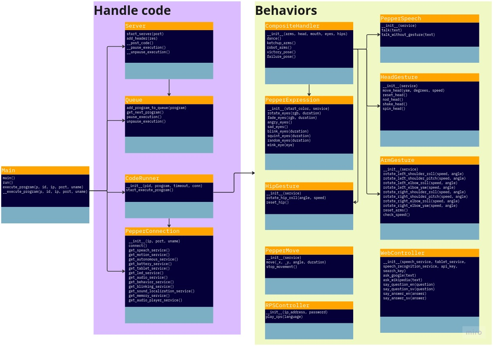

# Block Server
This repository works as a server which handles connection from blockly and to the Pepper robot. This server is written in Python and uses Flask as an API. The API is following the standard of RESTful. The blockly site will send HTTP calls with the generated code from the block programming, this is then stored in our built-in queue. The server will then read from the queue and send the instructions to the Pepper robot. The code is executed in a separate environment which makes the main thread secure from dangerous code. This can also be run in a docker container which makes it easy to deploy.

The uml diagram of this project:


# Tools / Installation
We use the following tools:
* Python 2.7
* NAOqi-python-sdk version: 2.5.7.1
* Flask version: 1.1.4
* Multiprocess version: 0.70.13
* Pylint version: 1.9.5
* Typing version: 3.7.4

## <a name="Installation"></a> Installation

Install python 2.7 from their official website: https://www.python.org/downloads/ .

Then install naoqi from their official website: https://developer.softbankrobotics.com/pepper-naoqi-25-downloads .

When both of these are installed, you can install the rest of the dependencies by running the following command in the root of the repository:
```
pip2 install -r requirements.txt
```

## Why these tools?
The naoqi sdk is needed to communicate with the Pepper robot, unfortunately, this is only available for Python 2.7.

Flask is used as an API to communicate with the blockly site.

Multiprocess is used to run code in a separate environment.

Pylint is used to check the code for errors and to make sure the code is following the PEP8 standard.

Typing is used to make sure the code is following the PEP484 standard, this is used for typing variables to example lists or tuples.

<!-- This setion should start with a tl;dr about which tools are used, what the tools do, and why they were chosen. If there is a critical functionality being provided by the tool it should be specified what it is and where it is needed. It should generally be done as shown below.


> [Tool 1 (this should also link to the tools md file)](tools.md)

Tool 1 was chosen because it is important for this functionality, it also has pre-built interoperability with this other thing, which is useful since we use that as well. If another alternative was considered it can be mentioned here, that way it is easy to find if problems arise from this tool later on and it has to be removed from the project. If applicable, a link to the tools own documentation or website/github should be provided *here*. -->

# Usage

## Prerequisites
### Server
Make sure all your dependencies are installed, see the [Installation](#Installation) section for more information.

If you are running in docker you need to add a .env file in the root of the directory, this file should contain the following:
```
PEPPER_PASSWORD="xxx"
PEPPER_PORT=9559
PEPPER_IP="xxx.xxx.xxx.xxx"
PEPPER_USERNAME="name"
PORT=5000 # port for the server
ASK_SEARCH_KEY="xxx" # Search key for Google API, useful for web interaction
ASK_API_KEY="xxx" # API key for Google API, useful for web interaction
```
This file is used to pass in environment variables to the docker container. If you are running the server locally you can just add these variables to your system environment variables or change the code in main.py to use your own variables.

### Pepper robot
Make sure that the Pepper robot is on and connected to the same wifi as you are.

## Running the server
### Locally
To run the server you can use the following command:
```
python2 main.py
```

### Docker
If you have chosen another port then 5000 you have to change the port in the docker-compose.yml file to be able to connect to the docker container.

To build the docker image you can use the following command:
```
docker build . -t block-server
```

To run the server in docker you can use the following command:
```
docker compose up
```

### Output
The resulting output when running the program should be:
```
 * Serving Flask app "API" (lazy loading)
 * Environment: production
   WARNING: This is a development server. Do not use it in a production deployment.
   Use a production WSGI server instead.
 * Debug mode: off
 * Running on http://0.0.0.0:5000/ (Press CTRL+C to quit)
Ready to run programs!
```
If you are not doing anything this shouldn't change.

The server should now be open to receive connections from the blockly site, you can also send custom messages using simple HTTP calls but this is not recommended. To try the connection run the blockly site and try to send a program to the server. The server should print out when it receives a message and when it sends a message to the Pepper robot.
## Examples
When sending a POST request to the url "IP_OF_SERVER:PORT_OF_SERVER/code?name=Example%20name" with the following body:
```
pep_expr.angry_eyes()
```
The outcome on Pepper should be that the robot will get red eyes. The console outcome will be similar to this:
```
block-server  | 172.18.0.1 - - [25/Nov/2022 13:27:52] "POST /code?name=Example%20name HTTP/1.1" 200 -
block-server  | Starting a program
block-server  | > 13:27:53.09 - 1 - Trying to connect to Pepper - Name: Example name
block-server  | Successfully connected to robot
block-server  | [W] 1669382873.749097 14 qi.path.sdklayout: No Application was created, trying to deduce paths
block-server  | > 13:27:57.10 - 1 - Resetting Pepper - Name: Example name
block-server  | > 13:27:57.95 - 1 - Done with resetting Pepper - Name: Example name
block-server  | > 13:27:57.95 - 1 - Running the program - Name: Example name
block-server  | > 13:27:59.19 - 1 - Stopping the program - Name: Example name
block-server  | > 13:27:59.96 - 1 - Resetting Pepper - Name: Example name
block-server  | > 13:28:02.71 - 1 - Done with resetting Pepper - Name: Example name
block-server  | Program has been completed, ready for next task
```

# License
MIT